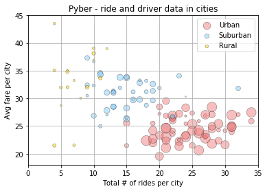

```python
import matplotlib.pyplot as plt
import numpy as np
import os
import csv
import pandas as pd

```


```python
#import city and ride data as data frames

city_csv = "city_data.csv"
city_data = pd.read_csv(city_csv)
city_data_sorted = city_data.sort_values("city")

city_data_reset = city_data_sorted.reset_index(drop=True)
city_data_clean = city_data_reset.drop_duplicates("city")
city_data_clean_indexed = city_data_clean.set_index("city")

ride_csv = "ride_data.csv"
ride_data = pd.read_csv(ride_csv)
print(ride_data.head())
print(city_data_clean_indexed.head())


```

              city                 date   fare        ride_id
    0     Sarabury  2016-01-16 13:49:27  38.35  5403689035038
    1    South Roy  2016-01-02 18:42:34  17.49  4036272335942
    2  Wiseborough  2016-01-21 17:35:29  44.18  3645042422587
    3  Spencertown  2016-07-31 14:53:22   6.87  2242596575892
    4   Nguyenbury  2016-07-09 04:42:44   6.28  1543057793673
                  driver_count      type
    city                                
    Alvarezhaven            21     Urban
    Alyssaberg              67     Urban
    Anitamouth              16  Suburban
    Antoniomouth            21     Urban
    Aprilchester            49     Urban


```python
city_data_clean_indexed.head()
```


<div>
<style scoped>
    .dataframe tbody tr th:only-of-type {
        vertical-align: middle;
    }

    .dataframe tbody tr th {
        vertical-align: top;
    }

    .dataframe thead th {
        text-align: right;
    }
</style>
<table border="1" class="dataframe">
  <thead>
    <tr style="text-align: right;">
      <th></th>
      <th>driver_count</th>
      <th>type</th>
    </tr>
    <tr>
      <th>city</th>
      <th></th>
      <th></th>
    </tr>
  </thead>
  <tbody>
    <tr>
      <th>Alvarezhaven</th>
      <td>21</td>
      <td>Urban</td>
    </tr>
    <tr>
      <th>Alyssaberg</th>
      <td>67</td>
      <td>Urban</td>
    </tr>
    <tr>
      <th>Anitamouth</th>
      <td>16</td>
      <td>Suburban</td>
    </tr>
    <tr>
      <th>Antoniomouth</th>
      <td>21</td>
      <td>Urban</td>
    </tr>
    <tr>
      <th>Aprilchester</th>
      <td>49</td>
      <td>Urban</td>
    </tr>
  </tbody>
</table>
</div>


```python
#Pull data for just Urban cities and use groupby to get total fares and rides per city
#urban_rides = city_data_clean_indexed.loc[city_data_clean_indexed["type"=="Urban"]]
```


```python
#groupby the city name to get total fares per city and ride count per city

city_groups = ride_data.groupby("city")
total_fares = city_groups["fare"].sum()
ride_count = city_groups["city"].count()

ride_count.head()
```


    city
    Alvarezhaven    31
    Alyssaberg      26
    Anitamouth       9
    Antoniomouth    22
    Aprilchester    19
    Name: city, dtype: int64


```python
#add new ride count, total fares and average fares to data frame

city_data_clean_indexed["ride_count"] = ride_count
city_data_clean_indexed["total_fares"] = total_fares
average_fare = total_fares / ride_count
city_data_clean_indexed["avg_fare"]= average_fare
city_data_clean_indexed.head()
```


<div>
<style scoped>
    .dataframe tbody tr th:only-of-type {
        vertical-align: middle;
    }

    .dataframe tbody tr th {
        vertical-align: top;
    }

    .dataframe thead th {
        text-align: right;
    }
</style>
<table border="1" class="dataframe">
  <thead>
    <tr style="text-align: right;">
      <th></th>
      <th>driver_count</th>
      <th>type</th>
      <th>ride_count</th>
      <th>total_fares</th>
      <th>avg_fare</th>
    </tr>
    <tr>
      <th>city</th>
      <th></th>
      <th></th>
      <th></th>
      <th></th>
      <th></th>
    </tr>
  </thead>
  <tbody>
    <tr>
      <th>Alvarezhaven</th>
      <td>21</td>
      <td>Urban</td>
      <td>31</td>
      <td>741.79</td>
      <td>23.928710</td>
    </tr>
    <tr>
      <th>Alyssaberg</th>
      <td>67</td>
      <td>Urban</td>
      <td>26</td>
      <td>535.85</td>
      <td>20.609615</td>
    </tr>
    <tr>
      <th>Anitamouth</th>
      <td>16</td>
      <td>Suburban</td>
      <td>9</td>
      <td>335.84</td>
      <td>37.315556</td>
    </tr>
    <tr>
      <th>Antoniomouth</th>
      <td>21</td>
      <td>Urban</td>
      <td>22</td>
      <td>519.75</td>
      <td>23.625000</td>
    </tr>
    <tr>
      <th>Aprilchester</th>
      <td>49</td>
      <td>Urban</td>
      <td>19</td>
      <td>417.65</td>
      <td>21.981579</td>
    </tr>
  </tbody>
</table>
</div>


```python
#Seperate data frame into 3 new df's based on city type in order to plot seperately on bubble plot

urban_df = city_data_clean_indexed.loc[city_data_clean_indexed["type"]=="Urban"]
suburban_df = city_data_clean_indexed.loc[city_data_clean_indexed["type"]=="Suburban"]
rural_df = city_data_clean_indexed.loc[city_data_clean_indexed["type"]=="Rural"]

```


```python
#create variables for ride_count, avg_fare and driver_count series for each new df 

urban_rides = urban_df["ride_count"]
urban_drivers = urban_df["driver_count"]
urban_avg_fare = urban_df["avg_fare"]

suburban_rides = suburban_df["ride_count"]
suburban_drivers = suburban_df["driver_count"]
suburban_avg_fare = suburban_df["avg_fare"]

rural_rides = rural_df["ride_count"]
rural_drivers = rural_df["driver_count"]
rural_avg_fare = rural_df["avg_fare"]

```


```python
#create bubble plots using variables from 3 data frames 

plt.scatter(urban_rides, urban_avg_fare, marker="o", facecolors="lightcoral",
            s=urban_drivers*3, alpha=.5, edgecolors="black", label = "Urban", linewidth = .5)
plt.scatter(suburban_rides, suburban_avg_fare, marker="o", facecolors="lightskyblue",
            s=suburban_drivers*3, alpha=.5, edgecolors="black", label = "Suburban", linewidth = .5)
plt.scatter(rural_rides, rural_avg_fare, marker="o", facecolors="gold",
            s=rural_drivers*3, alpha=.50, edgecolors="black", label = "Rural", linewidth = .5)

plt.xlim(0, 35)
plt.ylim(18,45)
plt.grid()
plt.ylabel("Avg fare per city")
plt.xlabel("Total # of rides per city")
plt.title("Pyber - ride and driver data in cities")
plt.legend( loc="best")
plt.savefig("Pyber - BubblePlot.png")
plt.show()

```





```python
#groupby city type to get the total fares per city type and percent fares per city type

city_type_groups = city_data_clean_indexed.groupby("type")
fares_type = city_type_groups["total_fares"].sum()
total_fares = city_data_clean_indexed["total_fares"].sum()
percent_fares = (fares_type/total_fares)*100
percent_fares
```


    type
    Rural        6.68500
    Suburban    30.34954
    Urban       62.96546
    Name: total_fares, dtype: float64


```python
#Create pie chart to show percent total fares per city type 

explode = (.2,0,0)
colors = ['gold', 'lightskyblue', 'lightcoral']
pies = ["Rural", "Suburban","Urban"]

fig1, ax1 = plt.subplots()
ax1.pie(percent_fares, explode=explode, labels=pies \
       , autopct="%1.1f%%", shadow=True, startangle=0, colors=colors)
ax1.axis('equal') 
plt.title("Percentage of total fares per city type")
plt.show()

```


```python
# Use groupby city type to find total rides and percent rides per city type

rides_type = city_type_groups["ride_count"].sum()
total_rides = city_data_clean_indexed["ride_count"].sum()
percent_rides = (rides_type/total_rides)*100
percent_rides
```


    type
    Rural        5.263158
    Suburban    26.315789
    Urban       68.421053
    Name: ride_count, dtype: float64


```python
#Create pie chart to show percent total rides per city type 

explode = (.3,0,0)
colors = ['gold', 'lightskyblue', 'lightcoral']
pies = ["Rural", "Suburban","Urban"]

fig1, ax1 = plt.subplots()
ax1.pie(percent_rides, explode=explode, labels=pies \
       , autopct="%1.1f%%", shadow=True, startangle=0, colors=colors)
ax1.axis('equal') 
plt.title("Percentage of total rides per city type")
plt.show()
```


```python
# Use groupby city type to find total drivers and percent drivers per city type

drivers_type = city_type_groups["driver_count"].sum()
total_drivers = city_data_clean_indexed["driver_count"].sum()
percent_drivers = (drivers_type/total_drivers)*100
```


```python
#Create pie chart to show percent total drivers per city type

explode = (.4,0,0)
colors = ['gold', 'lightskyblue', 'lightcoral']
pies = ["Rural", "Suburban","Urban"]

fig1, ax1 = plt.subplots()
ax1.pie(percent_drivers, explode=explode, labels=pies \
       , autopct="%1.1f%%", shadow=True, startangle=0, colors=colors)
ax1.axis('equal') 
plt.title("Percentage of total drivers per city type")
plt.show()
```


```python


```
